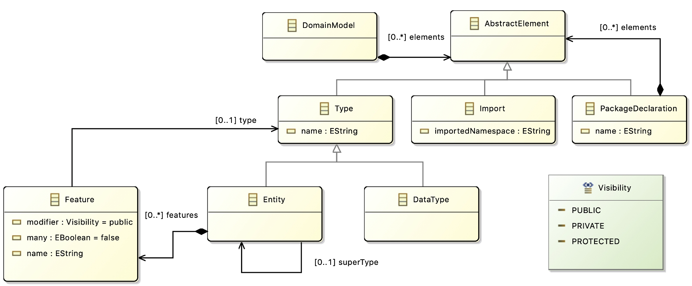

<link rel='stylesheet' href='web/swiss.css'/>

# Code Generation with Groovy

The **goal** of this tutorial is to use Groovy to generate code from models that are parsed with xText. This worksheet provides the code of the examples used in the taught units 2 and 3 and in there you will find a code walkthrough.

The metamodel of the DSL is included below for helping in doing the exercises:



This worksheet can also be found in `co7217.mu6.entity.parent/readme.md`.

## Download the project from Blackboard

* Import the project `co7217.mu6.entity.parent` using Gradle. This Xtext project corresponds to the domain modelling DSL being used in the taught units.
* The grammar of the EntityDsl can be found at `co7217.mu6.entity/src/main/java/co7217.xtext.entity/EntityDsl.xtext`
* Sample code generators can be found in the folder `co7217.mu6.entity/src/main/java/`
  * `co7217.mu6.entity.generator.EntityGenerator_ExplicitTraversal_JavaClasses` is the code of the example used in taught unit 2 (M2T with Groovy (1)) and generates Java code in separate files using an explicit traversal strategy.
  * `co7217.mu6.entity.generator.EntityGenerator_Visitor_Serialization` is the code of the example used in taught unit 3 (M2T with Groovy (2)) and serializes models using the concrete syntax of the DSL.


## Exercise 1: Serialization with explicit traversal

**Goal:** Develop a code generator for the DSL that serializes models for the DSL.

Under the folder `co7217.mu6.entity/src/main/java/`, the file `co7217.mu6.entity.generator.EntityGenerator_ExplicitTraversal_Serialization` provides an skeleton of the model compiler. The output code should be stored in one single file.

Create your model to text transformation logic in the method `processElement(AbstractElement el)`. Feel free to use all the facilities of the Groovy language.

To find examples for your generator, create new models with the web editor of the DSL (using the Gradle task `jettyRun` as shown in the previous module unit on Xtext). 

## Exercise 2 

**Goal:** Develop a model compiler for the DSL generating Java code from models using the adaptation of the visitor pattern explained in taught unit 3.

Under the folder `co7217.mu6.entity/src/main/java/`, the file `co7217.mu6.entity.generator.submission_exercise.groovy` provides an skeleton of the model compiler. The output code should be returned in a string, there is no need to persist in files.

The tasks to be done are marked with tags `TODO`:
* Update the username for running the SubmissionHelper.
* Complete the traversal strategy in the method `traverse(EObject)`.
* Complete the code generation part in the method `generate(EObject)`.

**Hints:** reuse parts of transformation logic available in the other examples provided. Watch taught units 2 and 3. 

The examples below should be implemented.


#### Example 1: 

The code in file `example1.domain`:

```datatype String

package RentACar {

	entity Car {
		drivingPlate : String
	}

}
```

should be compiled to 

```java
package RentACar;

public class Car  {
	
	private String drivingPlate;
	
	public String getDrivingPlate() {
		return drivingPlate;
	}
	
	public void setDrivingPlate(String drivingPlate) {
		this.drivingPlate = drivingPlate;
	}

}
```

#### Example 2: 

The code in file `examples2.domain`

```
datatype String

entity Blog {
   title: String
   many posts: Post
}

entity HasAuthor {
   author: String
}

entity Post extends HasAuthor {
   title: String
   content: String
   many comments: Comment
}

entity Comment extends HasAuthor {
   content: String
}
```

should be compiled to

```java
public class Blog  {
	
	private String title;
	
	public String getTitle() {
		return title;
	}
	
	public void setTitle(String title) {
		this.title = title;
	}

	private Post posts;
	
	public Post getPosts() {
		return posts;
	}
	
	public void setPosts(Post posts) {
		this.posts = posts;
	}

}

public class HasAuthor  {
	
	private String author;
	
	public String getAuthor() {
		return author;
	}
	
	public void setAuthor(String author) {
		this.author = author;
	}

}

public class Post extends HasAuthor {
	
	private String title;
	
	public String getTitle() {
		return title;
	}
	
	public void setTitle(String title) {
		this.title = title;
	}

	private String content;
	
	public String getContent() {
		return content;
	}
	
	public void setContent(String content) {
		this.content = content;
	}

	private Comment comments;
	
	public Comment getComments() {
		return comments;
	}
	
	public void setComments(Comment comments) {
		this.comments = comments;
	}

}

public class Comment extends HasAuthor {
	
	private String content;
	
	public String getContent() {
		return content;
	}
	
	public void setContent(String content) {
		this.content = content;
	}
}
```

## Additional resources

This worksheet builds on the resources used in previous taught units on Groovy, EMF and Xtext. Revise the documentation provided for the corresponding module units.

***
&copy; Artur Boronat, 2023
